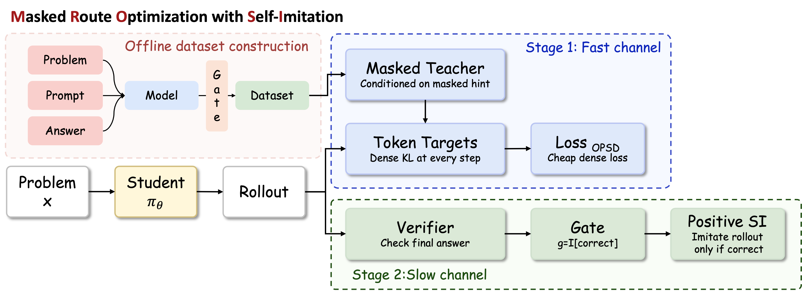

# MRO-SI

MRO-SI (Masked Route Optimization with Self-Imitation) trains a math reasoning model with two complementary signals:

1. A masked-route fast channel: the teacher receives a derivation route whose final result is hidden, then distills token-level guidance to the student on student-generated rollouts.
2. A verifier slow channel: once training is warm, student rollouts with a correct final boxed answer are used as positive self-imitation targets.

## Method Overview



The masked route gives dense process-level supervision without exposing the requested final result. The verifier then adds sparse outcome-level calibration by selecting only correct student rollouts for self-imitation. The core training objective is:


Self-imitation is applied only after the configured start step, and only when the verifier confirms that the rollout's final boxed answer matches the reference.

## Main Results


## Repository Layout

```text
MRO-SI/
  mro_si/
    train.py                    # MRO-SI training entrypoint
    trainer.py                  # MRO-SI trainer
    data_collator.py            # student and masked-teacher prompt builder
    masked_derivation_utils.py  # parsing, leakage checks, fallback masking
    verifier_utils.py           # boxed-answer extraction and verification
  scripts/
    build_masked_derivations.py         # create masked-route data
    prepare_math_train_minus_math500.py # optional MATH train preprocessing
    run_full_pipeline.sh                # build masked data, train, and evaluate
    run_mrosi_train_eval.sh             # train and evaluate checkpoints
  eval/
    evaluate_math.py            # vLLM evaluation on MATH/AIME/HMMT style datasets
  assets/
    architecture.png
    loss.png
    main_results.png
  accelerate.yaml
  requirements.txt
```

## Installation

```bash
cd MRO-SI
pip install -r requirements.txt
```

The code expects recent `transformers`, `trl`, `accelerate`, `vllm`, `peft`, and `math-verify`. For multi-GPU training, update `accelerate.yaml` to match your cluster.

## Data Format

Training data is JSONL or a Hugging Face dataset with at least:

```json
{
  "problem": "Problem statement",
  "solution": "Reference solution with \\boxed{answer}",
  "masked_derivation": "A route hint that hides the final result with [OMITTED]"
}
```

Optional fields:

```json
{
  "Answer": "answer",
  "masked_derivation_source": "generated"
}
```

## Full Pipeline

Run the complete MRO-SI workflow from raw training data to post-training and evaluation:

```bash
CUDA_VISIBLE_DEVICES=0,1,2,3 \
BASE_MODEL=/path/to/Qwen3-1.7B \
MASK_GENERATOR_MODEL=/path/to/Qwen3-4B \
RAW_DATASET=data/train.jsonl \
MASKED_DATASET=data/train_masked.jsonl \
MAX_STEPS=200 \
EVAL_VAL_N=12 \
bash scripts/run_full_pipeline.sh
```

The full pipeline script first builds `MASKED_DATASET` with `scripts/build_masked_derivations.py`, then launches MRO-SI post-training and checkpoint evaluation through `scripts/run_mrosi_train_eval.sh`.

By default, `BUILD_MASKED_DATASET=auto`, so existing masked data is reused. Set `BUILD_MASKED_DATASET=true` to rebuild it, or `BUILD_MASKED_DATASET=false` to require an existing file.

## Build Masked Derivations

Use a stronger local model through vLLM:

```bash
python scripts/build_masked_derivations.py \
  --dataset_name_or_path data/train.jsonl \
  --dataset_split train \
  --generation_backend vllm \
  --model_name_or_path /path/to/teacher-model \
  --output_path data/train_masked.jsonl \
  --problem_column problem \
  --solution_column solution \
  --answer_column Answer \
  --tensor_parallel_size 4 \
  --batch_size 16 \
  --max_new_tokens 1024 \
  --resume
```

Or use an OpenAI-compatible API:

```bash
export MASK_API_BASE_URL="https://your-api.example/v1"
export MASK_API_KEY="..."

python scripts/build_masked_derivations.py \
  --dataset_name_or_path data/train.jsonl \
  --generation_backend openai_api \
  --api_model qwen3-32b \
  --output_path data/train_masked.jsonl \
  --resume
```

Each generated hint is calibrated for JSON validity, `[OMITTED]` usage, prompt echo, and answer leakage. If generation fails, the script can fall back to a conservatively redacted reference solution.

## Train MRO-SI

Launch an MRO-SI training run:

```bash
CUDA_VISIBLE_DEVICES=0,1,2,3 \
BASE_MODEL=/path/to/Qwen3-1.7B \
MASKED_DATASET=data/train_masked.jsonl \
MAX_STEPS=100 \
MROSI_SELF_IMITATION_START_STEP=75 \
bash scripts/run_mrosi_train_eval.sh
```

Important knobs:

```bash
MROSI_SELF_IMITATION_WEIGHT=0.01
MROSI_SELF_IMITATION_START_STEP=75
TOP_K_LOSS=200
JSD_TOKEN_CLIP=0.05
TRAIN_VLLM_GPU_MEMORY_UTILIZATION=0.4
EVAL_VAL_N=12
```

## Evaluate

Evaluate a LoRA checkpoint with vLLM:

```bash
python eval/evaluate_math.py \
  --base_model /path/to/Qwen3-1.7B \
  --checkpoint_dir outputs/mrosi/<run_name>/checkpoint-100 \
  --dataset aime24 \
  --val_n 12 \
  --temperature 1.0 \
  --tensor_parallel_size 4 \
  --output_file eval_results/aime24_checkpoint100.json
```

Supported dataset names in the bundled evaluator include `math500`, `aime24`, `aime25`, `hmmt25`, `minerva`, `amc23`, and `amo-bench`.
